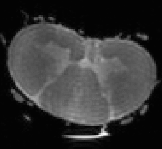

# Grey and white matters segmentation on exvivo T2 human data



Segmentation model for human spinal gray and white matter on T2 data.

Created with [ivadomed](http://ivadomed.org/) using data from University of Queensland 🇦🇺.
Training features include: 2D unet, multiclass, SoftSeg.

This model is readily available in [SCT](https://spinalcordtoolbox.com/en/stable/) (v5.1.1 and higher)

... can be installed as follows:
```bash
sct_deepseg -install-task seg_mice_gm-wm_dwi
```

... and can be used as follows:
```bash
sct_deepseg -i NIFTI_IMAGE -task seg_mice_gm-wm_dwi
```

**Data acquisition:**
- Spin-echo, Stejskal-Tanner 3D diffusion weighted
- Resolution: 0.156 mm isotropic
- 18 diffusion weighting directions + b0 image (Note: only the b0 was used to train the model)
- Bruker Paravision 5.1 at 9.4 T

Any question? Please feel free to post on [SCT forum](https://forum.spinalcordmri.org/c/sct/8). 
